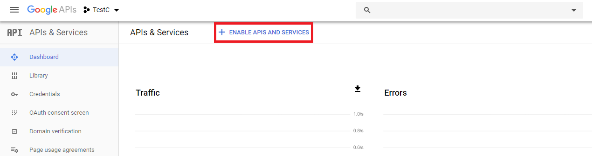
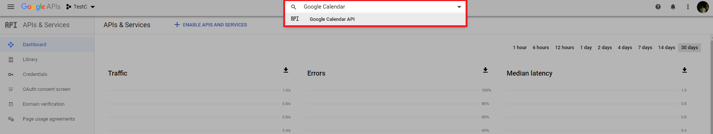
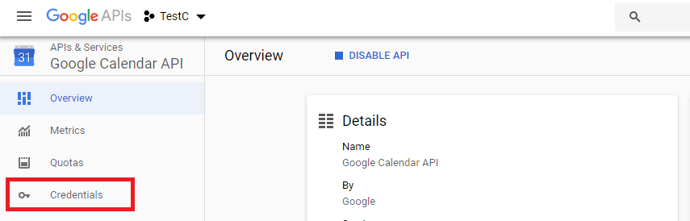
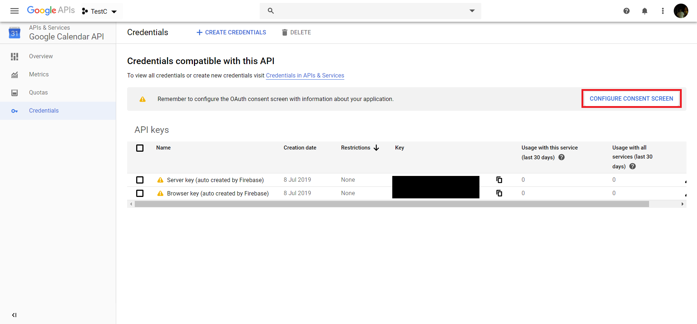
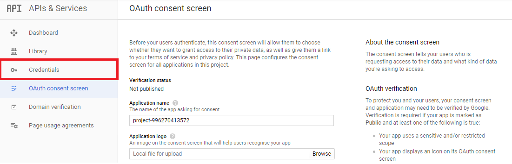
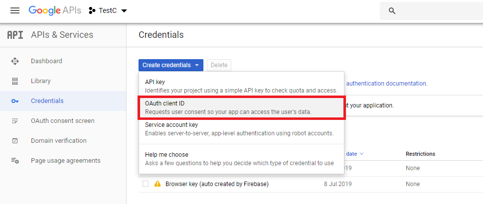
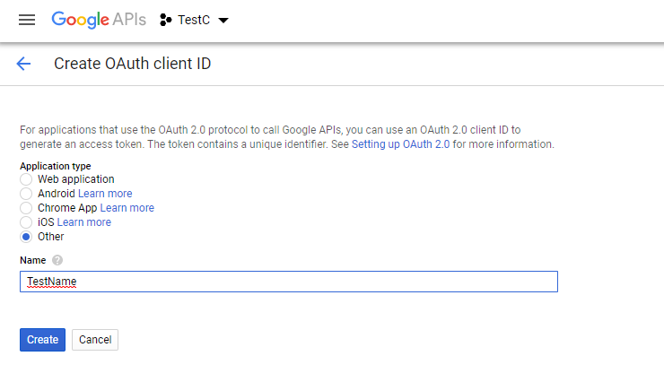
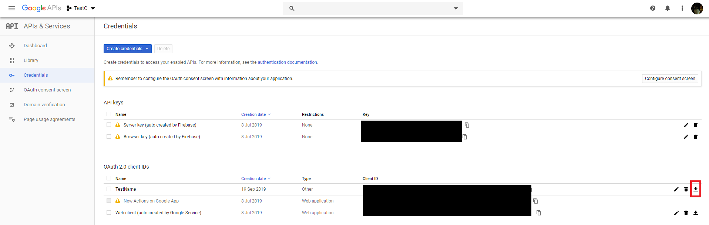

# Jovo Conversational Component: ScheduleMeeting

* [Getting Started](#getting-started)
  * [Installation](#installation)
* [Usage](#usage)
* [Sample Dialog](#sample-dialog)
* [Response](#response)
* [Configuration](#configuration)

## Getting Started

The component provides a prepackaged solution to book meetings using Google Calendar.

By delegating to the component, it will go through determining a meeting slot and emailing them the details.

> Currently, you have to parse user's email to the component. A cleaner version, where the component collects the email itself is in the works.

To specify "office hours", i.e. intervals at which a user can book a meeting, you simply create an event inside your calendar and specify its title in the components configuration as an unique identifier. The interval from the beginning of the event to the end will be divided into multiple slots each x (configurable) minutes long that the users can book.

Booked meetings are saved inside the calendar as events, where the title is the user's email.

> [Find out more about Jovo's Conversational Components](https://www.jovo.tech/docs/components)

### Installation

You can install the component using npm:

```sh
$ npm install --save jovo-component-schedule-meeting
```

After that, you use the Jovo CLI to transfer the component's files to your project using the `load` command:

```sh
$ jovo load jovo-component-schedule-meeting
```

Now, include the component in your `app.js`:

```js
// @language=typescript
// src/app.ts

import { ScheduleMeeting } from './components/jovo-component-schedule-meeting';

app.useComponents(new ScheduleMeeting());

// @language=javascript
// src/app.js

const { ScheduleMeeting } = require("../components/jovo-component-schedule-meeting");

app.useComponents(new ScheduleMeeting());
```

The last thing to do, is to set up the Google Calendar integration. For that you have to register the application on the [Google API Console](https://console.developers.google.com/):



After that you have to enable the `Google Calendar API`:



Now, you have to get your credentials:



Click on configure consent screen after that:



Now, back to Credentials, since for some reason the option we're actually looking for only appears if we go to the OAuth consent screen first:



There you can now create OAuth client ID credentials:



Select `other` as the application type and name your credentials:



Now, download your credentials:



Add the credentials file to your project and add it's path to your config file:

```js
// config.js

module.exports = {
    // ...
    components: {
        ScheduleMeeting: {
            credentialsPath: './credentials' // path to credentials from config file
        }
    }
};
```

Now, you have to run through the authorization process the get the initial token needed to access your Google Calendar. For that, run the `postinstall` script and follow its instructions:

```sh
# typescript:
$ npm run tsc
# from the root of your project:
$ node dist/src/components/ScheduleMeeting/src/scripts/postinstall

# javascript
# again from the root of your project
$ node src/components/ScheduleMeeting/src/scripts/postinstall
```

That's it for the installation.

## Usage

While delegating to the component, you **have** to parse the user's email address in the `data` object:

```js
this.delegate(scheduleMeeting.name, {
    onCompletedIntent: 'xyz',
    data: {
        email: 'xyz@jovo.tech'
    }
});
```

## Sample Dialog

SSML tags are not included in sample dialogs, but might be included in the responses.

<details>
<summary>Sample Dialog #1</summary>

User | Alexa Speech | Alexa Reprompt | Keys
--- | --- | --- | -
&nbsp; | Which days are most convenient for you? | &nbsp; | start-question
Friday | &nbsp; | &nbsp; | &nbsp;
&nbsp; | On friday I have 4 open slots. For example, at 8:30 AM, 9:15 AM and 14:00 PM PST. Which one should it be? | &nbsp; | date
8:30 AM | &nbsp; | &nbsp; | &nbsp; 
&nbsp; | Are you sure you want to book a meeting on Friday the 26th of July at 8:30 AM?  | &nbsp; | slot-confirmation
Yes | &nbsp; | &nbsp; | &nbsp;
----> delegation to GetEmail component <----

----> Send response back <----
</details>

<details>
<summary>Sample Dialog #2</summary>

User | Alexa Speech | Alexa Reprompt | Keys
--- | --- | --- | -
&nbsp; | Which days are most convenient for you? | &nbsp; | start-question
Friday | &nbsp; | &nbsp; | &nbsp;
&nbsp; | On friday I have 4 open slots. For example, at 8:30 AM, 9:15 AM and 14:00 PM PST. Which one should it be? | &nbsp; | date
What about next tuesday? | &nbsp; | &nbsp; | &nbsp; 
&nbsp; | On tuesday I have 6 open slots. For example, at 9:30 AM, 11:00 AM and 15:00 PM PST. Which one should it be? | &nbsp; | date
What about 12:00 PM? | &nbsp; | &nbsp; | &nbsp;
&nbsp; | Are you sure you want to book a meeting on tuesday the July 30 at 12:00 PM?  | &nbsp; | slot-confirmation
Yes | &nbsp; | &nbsp; | &nbsp;
----> delegation to GetEmail component <----

----> Send response back <----
</details>

<details>
<summary>Sample Dialog #3</summary>

User | Alexa Speech | Alexa Reprompt | Keys
--- | --- | --- | -
&nbsp; | Which days are most convenient for you? | &nbsp; | start-question
Friday | &nbsp; | &nbsp; | &nbsp;
&nbsp; | On friday I have 4 open slots. For example, at 8:30 AM, 9:15 AM and 14:00 PM PST. Which one should it be? | &nbsp; | date
What about 12:00 PM? | &nbsp; | &nbsp; | &nbsp;
&nbsp; | The slot you requested is not available. Please choose a different one.  | &nbsp; | slot-unavailable
11:00 AM | &nbsp; | &nbsp; | &nbsp;
&nbsp; | Are you sure you want to book a meeting on Friday the 26th of July at 11:00 AM?  | &nbsp; | slot-confirmation
Yes | &nbsp; | &nbsp; | &nbsp;
----> delegation to GetEmail component <----

----> Send response back <----
</details>

<details>
<summary>Sample Dialog #4</summary>

User | Alexa Speech | Alexa Reprompt | Keys
--- | --- | --- | -
&nbsp; | Which days are most convenient for you? | &nbsp; | start-question
Friday | &nbsp; | &nbsp; | &nbsp;
&nbsp; | On friday I have 4 open slots. For example, at 8:30 AM, 9:15 AM and 14:00 PM PST. Which one should it be? | &nbsp; | date
8:30 AM | &nbsp; | &nbsp; | &nbsp; 
&nbsp; | Are you sure you want to book a meeting on Friday the 26th of July at 8:30 AM?  | &nbsp; | slot-confirmation
No | &nbsp; | &nbsp; | &nbsp;
&nbsp; | Ok, either choose a new date or a new slot for the current one! | &nbsp; | slot-confirmation-denied

----> selects and confirms available slot <----

----> delegation to GetEmail component <----

----> Send response back <----
</details>

## Response

The component's `$response` has the following interface:

```javascript
{
    status: "SUCCESSFUL" | "REJECTED" | "ERROR"
}
```

It doesn't return any kind of data. If the status is set to `SUCCESSFUL` a meeting was created and the user received an email containing the details

> [Find out more about Conversational Component's responses](https://www.jovo.tech/docs/components#response)

## Configuration

The component provides a variety of configurable options.

Name | Descriptions | Type | Required
--- | --- | --- | ---
`calendarId` | The id of the calendar which the component should use | String | Yes
`eventLengthInMin` | The length of the bookable meeting slots in minutes | Number | No - Default: `15`
`intervalTitles` | Array specifying the titles of the intervals that specify the "office hours" | String[] | Yes
`eventOptions` | Object specifying the options for the event which will be created for each booked slot. [Google documentation](https://developers.google.com/calendar/v3/reference/events#resource). `attendee`, `end`, and `start` are set by the component. | Object | No

Example: 

```js
// config.js

module.exports = {
    // ...
    components: {
        'jovo-component-schedule-meeting': {
            calendarId: `primary`,
            eventLengthInMin: 15,
            intervalTitles: ['Test', 'TestTwo'],
            eventOptions: {
                reminders: {
                    useDefault: false,
                    overrides: [
                        {
                            method: 'email',
                            minutes: 10
                        }
                    ]
                }
            }
        }
    }
};
```


> [Find out more about Conversational Component's configuration](https://www.jovo.tech/docs/components#configuration)
